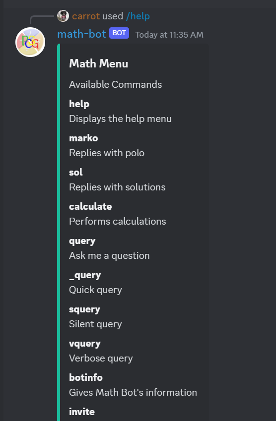
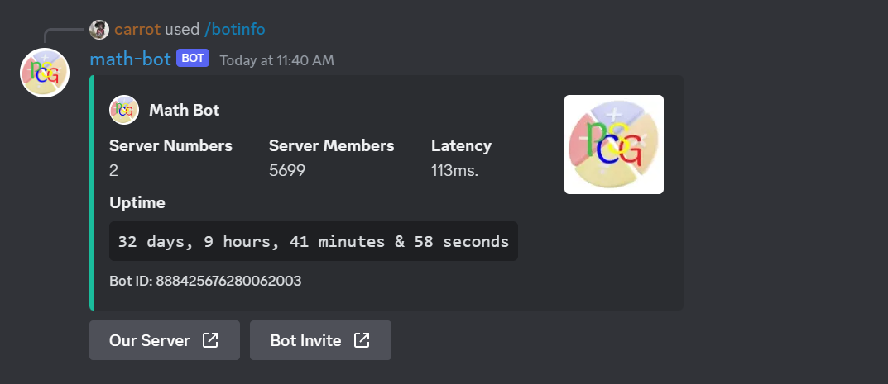
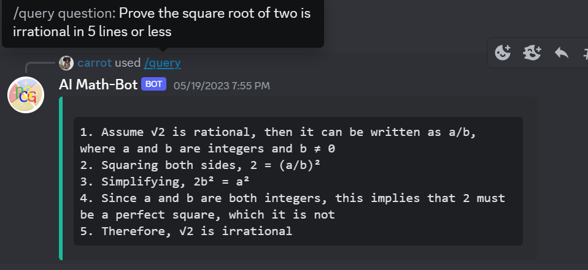

# Discord-Math-bot

## Overview

Math-Bot is a JavaScript-based Discord music bot created by Carrot, a first-year Computer Science student at the University of the West Indies (STA). The bot was developed using a self-developed private language learning model to solve CXC level questions.

## Commands

  <code>Math-bot offers the following commands:
</code>

- help
- sol
- query
- invite
- support
- botinfo
- calculate
- quick query
- silent query
- verbose query

## Usage

To use Math-Bot, you can join the support Discord server or PCSG's Discord server by simply clicking on the following link: https://discord.gg/vV2ZxkyuTt

Math-Bot operates using slash commands, which are intuitive and easy to use.

## Support

If you have any questions, issues, or suggestions regarding the Math-Bot, please feel free to contact Carrot on Discord at carrot#8856 or join the support server at https://discord.gg/TFEbHkCyT3.

## Where is the commands folder?

Due to the nature of the project, the code for commands is not open-source until a later date.

## Snippets
 
 
 
